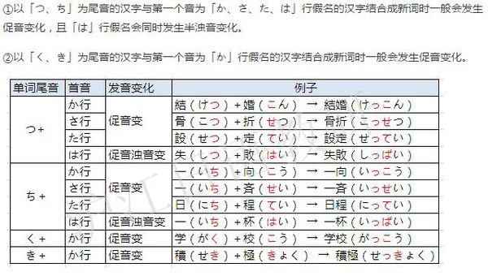

```
首先，当然是要体会到有长音、促音和没有长音、促音时发音的区别。长音和促音并不是只体现在文字上的，
掌握发音是准确记忆的最有效手段。

其次，如果是在汉字的音读中，可以联系汉字的发音来记忆。
一般来说，普通话中韵母为双元音（如ao、iu）或者带ng韵尾（如ang、ing）的时候，
日语容易出现长音，普通话韵母为单元音时日语一般不读长音。

日语音读的促音一般是汉语入声字的音读发生促音便的结果。
例如“作”是入声字，“作家”的发音是这么来的：さく＋か＝さっか。
当然，如果你只会普通话，不知道什么是“入声字”，这一条就没有什么帮助了。
```

<br/> <br/> <br/>


```
一般情况：
1.前鼻音（n）：拨音。后鼻音（ng）：长音。
命中率95%以上。
eg.
���g（jiandan）　かんたん 
生命（shengming）　せいめい
旅行（lvxing） りょこう
全然（quanran）　ぜんぜん
反例：
�糁小・啶沥澶Γ�可能是因为む假名几乎没有长音）　
探�伞・郡螭皮ぃㄕ�/侦的读音在现代汉语中属于不规则变化，规则变化应该为zheng）

2.中古汉语入声字（以塞音-p -t -k结尾）的汉字在日语中为双音节。
-p对应长音，-t对应ち つ，-k对应き く。后两者常常会发生促音变。
eg.
-k: 力　りょく　りき
-t: 八　はち　�g　じゅつ
-p: 合 ごう
命中率70%以上（如果不知道哪些是入声字可以忽略此项，如何判断入声请参考百度百科或者维基百科“入声”相关词条）。

促音变（来源沪江）：


3.普通话双音节汉字（ao ou iu）有较大概率为长音。
eg. 
�Q易　ぼうえき
偶然　ぐうぜん
�B休　れんきゅう

PS
上面主要是汉字词，对于某些拟声词或者副词（ぴったり、びっくり等等）也可能会出现促音，下面是常见的一些：
うっかり、すっかり、しっかり、すっきり、さっぱり、ぐっすり、にっこり、そっくり、はっきり。
```

<br/> <br/> <br/>

```
有的有规律，有的没有，一般都是靠长期记忆。
告诉你几个常用的。
长音，一般来说（有特殊的情况）一个汉字的拼音里面有g的音类似ang eng，那么这个汉字的音读有长音。
比如：张（ちょう）

促音，两个汉字或以上组成单词时，第一个汉字的最后一个假名为く而紧随其后的汉字的第一个假名为か行假名时，く通常变成促音。
比如：学科（がっか）がく＋か＝がっか

拨音还比较好记忆了，没发现什么规律。


```


